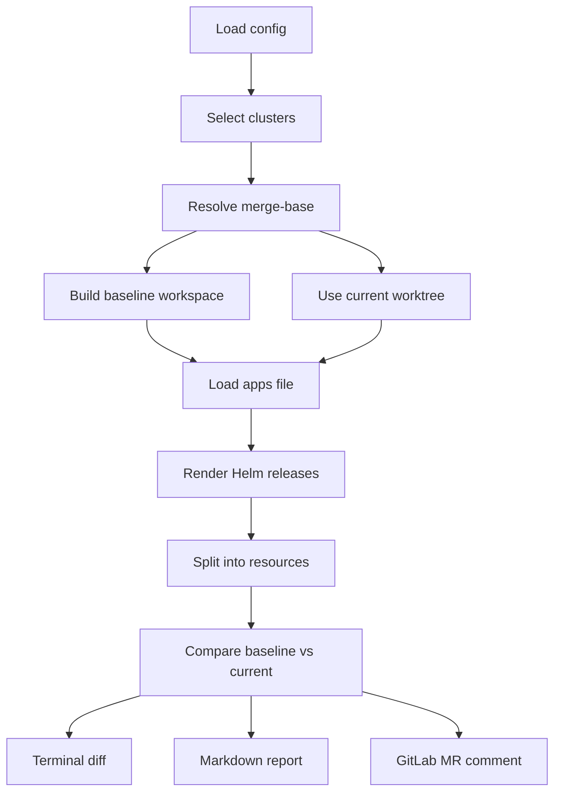

# møbius

`møbius` ("möbius") is a small Go CLI for GitOps repositories that manage Kubernetes clusters with ArgoCD.

It renders the effective Helm-based cluster configuration at:
- the merge-base with the target branch
- the current merge request state

Then it compares both rendered results chart by chart and resource by resource, so reviewers can see what the merge request would actually change in the cluster.

> The name comes from *StarCraft*: the Moebius Foundation was a formerly legitimate research group focused on archaeology. It explored sites created by a race older than the protoss, including Research Site KL-2.

## Installation

Install the CLI locally with Go:

```bash
go install github.com/sohooo/moebius/cmd/mobius@latest
```

Install a pinned version:

```bash
go install github.com/sohooo/moebius/cmd/mobius@v0.1.8
```

This requires a local Go toolchain.

- local `go install` produces a `mobius` binary
- the published container image provides both `mobius` and the Unicode alias `møbius`
- GitLab CI examples below use the container image and the `møbius` alias

Print the installed build metadata:

```bash
mobius version
```

## Quickstart

Run a local diff:

```bash
mobius diff --cluster kube-bravo
```

Render markdown output for copy/paste into a merge request:

```bash
mobius diff --cluster kube-bravo --output-format markdown
```

Inspect discovered clusters before diffing:

```bash
mobius clusters
```

Run a fast local preflight:

```bash
mobius doctor
```

If GitLab CI variables or GitLab tokens are present in your environment, `mobius doctor` also runs live GitLab comment-readiness checks.

Add `møbius comment` to a GitLab MR pipeline:

```yaml
mobius-diff:
  stage: test
  image: ghcr.io/sohooo/moebius:v0.1.8
  variables:
    GIT_DEPTH: "0"
    GITLAB_TOKEN: "${MOBIUS_GITLAB_TOKEN}"
  script:
    - git fetch origin "${CI_MERGE_REQUEST_TARGET_BRANCH_NAME}:${CI_MERGE_REQUEST_TARGET_BRANCH_NAME}"
    - |
      møbius comment \
        --base-ref "${CI_MERGE_REQUEST_TARGET_BRANCH_NAME}" \
        --output-dir .mobius-out
  artifacts:
    when: always
    paths:
      - .mobius-out/
```

This is the recommended production path:
- use a dedicated GitLab API token with note-writing permission
- fetch the MR target branch explicitly
- keep `.mobius-out/` as the canonical debug surface

Base ref behavior:
- `--base-ref` wins when set explicitly
- otherwise `møbius` tries `origin/HEAD`, then `main`, then `master`

## Documentation

- GitLab CI guide: [docs/gitlab-ci.md](docs/gitlab-ci.md)
- Configuration and layout: [docs/configuration.md](docs/configuration.md)
- Troubleshooting: [docs/troubleshooting.md](docs/troubleshooting.md)
- Releases and distribution: [docs/releases.md](docs/releases.md)
- Schema bundles and maintenance: [docs/schema-bundles.md](docs/schema-bundles.md)

Sample outputs:
- Markdown report: [docs/sample-report.md](docs/sample-report.md)
- GitLab MR note: [docs/sample-comment.md](docs/sample-comment.md)

## What `møbius` Does

For each selected cluster, `møbius`:

1. loads layout configuration from built-in defaults, optional `config.yaml`, optional `MOBIUS_CONFIG_YAML`, and targeted CLI overrides
2. resolves the merge-base with the configured base ref
3. renders each release with the Helm Go SDK
4. splits the rendered output into individual Kubernetes resources
5. compares baseline and current resources semantically and as raw text
6. validates current rendered resources offline using structural checks, embedded schemas, rendered CRD schemas, and semantic validators
7. renders the result as terminal output, markdown, or a GitLab MR note



## Releases

- Go install path: `github.com/sohooo/moebius/cmd/mobius`
- GHCR image: `ghcr.io/sohooo/moebius:vX.Y.Z`
- GitHub Releases attach CLI archives and `checksums.txt`

Maintainer and release details are in [docs/releases.md](docs/releases.md).
