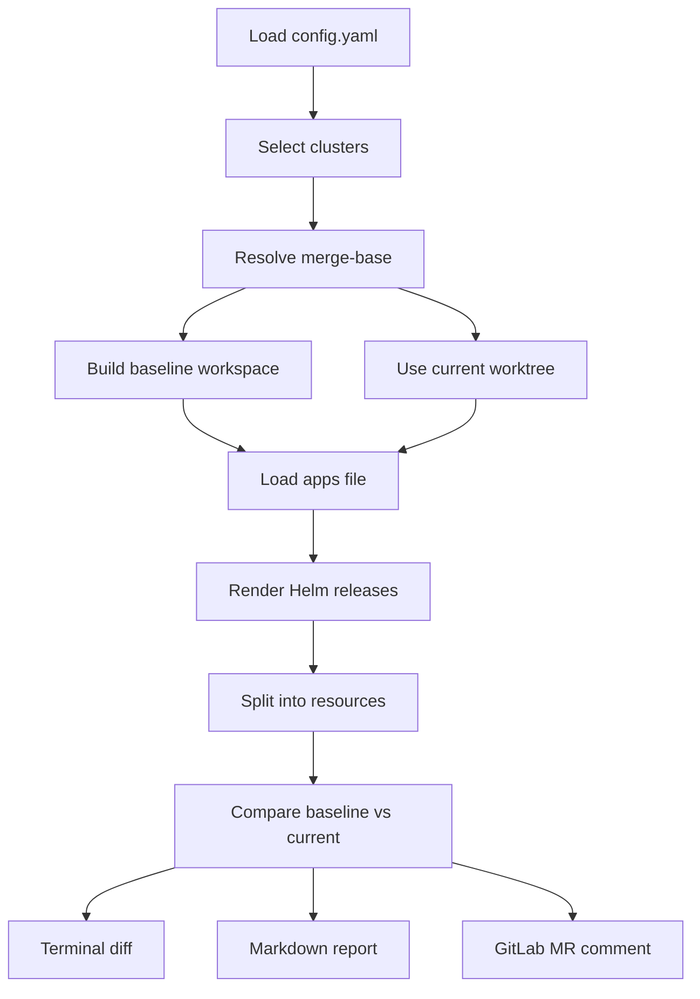

# møbius

`møbius` ("möbius") is a small Go CLI for GitOps repositories that manage Kubernetes clusters with ArgoCD.

Its job is to render the effective Helm-based cluster configuration for:
- the merge-base with the target branch
- the current merge request state

Then it compares both rendered results chart by chart and resource by resource, so reviewers can see what the merge request would actually change in the cluster.

> The name comes from *StarCraft*: the Moebius Foundation was a formerly legitimate research group focused on archaeology. It explored sites created by a race older than the protoss, including Research Site KL-2.

## Installation

Install the CLI locally with Go:

```bash
go install github.com/sohooo/moebius/cmd/mobius@latest
```

Install a pinned version:

```bash
go install github.com/sohooo/moebius/cmd/mobius@v0.1.3
```

This requires a local Go toolchain. For GitLab CI, the container image remains the recommended distribution path.

Print the installed build metadata:

```bash
mobius version
```

## CI Usage

`møbius` is designed to run as a separate tool in a GitLab merge request pipeline, typically from the cluster configuration repository. A common production setup is to build and publish the `møbius` image once, then run that image on a Kubernetes GitLab runner.

### Purpose

In CI, `møbius` is meant to answer one question for reviewers:

What effective cluster change will this merge request produce?

`møbius` renders the cluster configuration at the merge-base and at the MR commit, compares both results, and turns that into a readable report.

For CI usage there are two main modes:

- `møbius diff`
  Prints the report to the job output and optionally writes artifacts.
- `møbius comment`
  Posts the report back to the merge request as a sticky bot note.

Sample outputs:

- Markdown report: [docs/sample-report.md](docs/sample-report.md)
- GitLab MR note: [docs/sample-comment.md](docs/sample-comment.md)

### How `møbius comment` Works

When a GitLab MR pipeline runs `møbius comment`, it:

1. detects the current merge request from the GitLab CI environment
2. resolves the merge-base against the configured base ref
3. renders the effective cluster state at the merge-base and at the MR commit
4. compares both rendered states chart by chart and resource by resource
5. builds a GitLab-native markdown report
6. finds the existing `møbius` MR note, if one already exists
7. creates that note if it does not exist yet
8. updates the same note on later pipeline runs instead of creating duplicates
9. leaves the note unchanged if the rendered report body is already up to date

The posted note contains:

- a top-level review summary with total counts
- a severity breakdown across changed resources
- validation error and warning counts
- an unvalidated count when no matching schema bundle is available for some resources
- short highlights for the highest-severity findings
- a per-cluster summary table
- one collapsible section per chart
- compact chart summaries with counts, kinds, severity summaries, and notable changes
- resource-level diff sections inside each chart section
- semantic diff snippets that highlight the effective Kubernetes changes
- per-resource severity labels with short human-readable findings
- validation findings when a rendered resource is structurally invalid, schema-invalid, or semantically suspicious

If there are no effective changes, `møbius comment` updates the sticky note to a short no-change message instead of deleting it.

### Why This Is Useful

Using `møbius comment` in the MR pipeline makes the rendered diff part of the merge request discussion itself.

That gives reviewers:

- a stable, visible diff directly on the MR instead of only in job logs
- a report they can quote, reference, and discuss in review threads
- an updated view on every pipeline run without accumulating multiple bot comments
- a more compact MR note for larger diffs, with chart details expanded only when needed
- a clearer picture of the effective cluster change than raw values-file edits alone

For very large reports, `møbius` can automatically fall back to a compact summary note and point reviewers to the pipeline artifacts for the full details.

### Configuration

The job environment should:

- fetch enough git history for merge-base calculation
- make the merge request target branch ref available locally before running `møbius`
- provide the repository checkout
- provide `CI_PROJECT_ID`, `CI_MERGE_REQUEST_IID`, and `CI_JOB_TOKEN`
- provide either `CI_API_V4_URL` or `CI_SERVER_URL`
- provide network and credentials only if OCI chart access requires them

The repository in which the pipeline runs should include the cluster definitions and any referenced local charts. Layout configuration can come from built-in defaults, an optional repo-root [config.yaml](config.yaml), or the `MOBIUS_CONFIG_YAML` environment variable.

For repositories that already use the default layout, the pipeline only needs to reference the `møbius` image. No explicit layout config is required.

Default-layout example:

```yaml
mobius-diff:
  stage: test
  image: ghcr.io/sohooo/moebius:v0.1.3
  tags:
    - k8s
  variables:
    GIT_DEPTH: "0"
  script:
    - git fetch origin "${CI_MERGE_REQUEST_TARGET_BRANCH_NAME}:${CI_MERGE_REQUEST_TARGET_BRANCH_NAME}"
    - møbius comment --base-ref "${CI_MERGE_REQUEST_TARGET_BRANCH_NAME}" --output-dir .mobius-out
  artifacts:
    when: always
    paths:
      - .mobius-out/
```

This job uses the built-in defaults:

- clusters under `clusters/<cluster>`
- apps file `apps.yaml`
- release fields `name`, `namespace`, `project`, `repoURL`, `chart`, `targetRevision`
- overrides at `overrides/{project}/{name}.yaml`
- fallback overrides at `overrides/{name}.yaml`

Custom-layout example with configuration supplied entirely through CI:

```yaml
mobius-diff:
  stage: test
  image: ghcr.io/sohooo/moebius:v0.1.3
  tags:
    - k8s
  variables:
    GIT_DEPTH: "0"
    MOBIUS_CONFIG_YAML: |
      layout:
        clusters_dir: environments
        apps:
          file: releases.yaml
          fields:
            name: release_name
            namespace: target_namespace
            project: argocd_project
            repoURL: repo_url
            chart: chart_ref
            targetRevision: chart_target_revision
        overrides:
          path: values/{project}/{name}.yaml
          fallback_path: values/{name}.yaml
  script:
    - git fetch origin "${CI_MERGE_REQUEST_TARGET_BRANCH_NAME}:${CI_MERGE_REQUEST_TARGET_BRANCH_NAME}"
    - møbius comment --base-ref "${CI_MERGE_REQUEST_TARGET_BRANCH_NAME}" --output-dir .mobius-out
  artifacts:
    when: always
    paths:
      - .mobius-out/
```

The explicit `git fetch` is important in GitLab CI. Merge request jobs often run in a detached checkout that does not include a local ref for the target branch, so `møbius` cannot resolve the default base ref unless that branch is fetched first.

If one rendered release contains invalid YAML and you want the pipeline to keep reporting the rest, use:

```yaml
script:
  - git fetch origin "${CI_MERGE_REQUEST_TARGET_BRANCH_NAME}:${CI_MERGE_REQUEST_TARGET_BRANCH_NAME}"
  - møbius comment --base-ref "${CI_MERGE_REQUEST_TARGET_BRANCH_NAME}" --render-error-mode warn-skip-release --output-dir .mobius-out
```

In that mode, `møbius` keeps the raw `rendered.yaml`, skips only the broken release, and marks the report as incomplete with a visible render warning.

When `--output-dir .mobius-out` is used, `møbius` also writes:

- `.mobius-out/index.md` with a compact artifact overview
- `.mobius-out/summary.json` with machine-readable artifact and report counts
- `.mobius-out/errors/<state>--<cluster>--<release>.txt` for hard render failures
- `.mobius-out/warnings/<state>--<cluster>--<release>.txt` for non-fatal render warnings

This makes the failing release and preserved `rendered.yaml` path discoverable from CI artifacts even when the command exits non-zero.

If a third-party chart emits duplicate YAML keys and you need `møbius` to accept that output with a documented "last key wins" fallback, use:

```yaml
script:
  - git fetch origin "${CI_MERGE_REQUEST_TARGET_BRANCH_NAME}:${CI_MERGE_REQUEST_TARGET_BRANCH_NAME}"
  - møbius comment \
      --base-ref "${CI_MERGE_REQUEST_TARGET_BRANCH_NAME}" \
      --duplicate-key-mode warn-last-wins \
      --output-dir .mobius-out
```

In that mode, `møbius` keeps parsing the rendered manifest stream, uses the last duplicate mapping value, and records a warning in stdout and the MR note so the report is explicitly marked as non-strict.

Configuration precedence is:

1. built-in defaults
2. optional repo-root `config.yaml`
3. optional `MOBIUS_CONFIG_YAML`
4. targeted CLI overrides such as `--clusters-dir`

If you prefer to keep the diff only in job output, use `møbius diff`. If you want the report directly on the merge request, use `møbius comment`.

## Sample Report

A sample markdown report is available in [docs/sample-report.md](docs/sample-report.md).

A sample GitLab MR comment with collapsible chart sections is available in [docs/sample-comment.md](docs/sample-comment.md).

`møbius` can render markdown output for copy and paste, or post the same style of report directly into a GitLab merge request as a sticky bot comment.

## How It Works

For each selected cluster, `møbius`:

1. loads layout configuration from built-in defaults, optional [config.yaml](config.yaml), optional `MOBIUS_CONFIG_YAML`, and targeted CLI overrides
2. resolves the merge-base with the configured base ref
3. loads the configured apps file for each cluster
4. renders each release with the Helm Go SDK
5. applies override values from the configured override path
6. splits the rendered output into individual Kubernetes resources
7. compares baseline and current resources semantically and as raw text
8. validates current rendered resources offline using structural checks, embedded schemas, rendered CRD schemas, and semantic validators
9. renders the result as terminal output, markdown, or a GitLab MR note



Artifacts are written per chart and per resource:

- `current/<cluster>/<chart>/rendered.yaml`
- `current/<cluster>/<chart>/resources/<kind>--<namespace-or-cluster>--<name>.yaml`
- `baseline/<cluster>/<chart>/resources/<kind>--<namespace-or-cluster>--<name>.yaml`
- `diff/<cluster>/<chart>/<resource-key>.diff`
- `diff/<cluster>/<chart>/<resource-key>.semantic.txt`

The baseline is the git merge-base between `HEAD` and the configured base ref, not the current tip of the target branch.

Validation is offline-first:

- built-in Kubernetes resources use embedded schema bundles
- supported platform CRDs can use embedded schema bundles
- if a matching `CustomResourceDefinition` is rendered in the current chart, its schema takes precedence
- semantic validators add warnings for suspicious-but-schema-valid configurations
- reports distinguish schema-validated resources from unvalidated resources and show whether validation used a rendered CRD or an embedded schema bundle

## Quickstart

Build the binary:

```bash
make build
```

Show the local build metadata:

```bash
./bin/møbius version
```

Install the published CLI directly with Go:

```bash
go install github.com/sohooo/moebius/cmd/mobius@latest
```

Run the standard verification pass:

```bash
make verify
```

Render the diff for one cluster:

```bash
./bin/møbius diff --cluster kube-bravo
```

Render markdown output that is ready to paste into a merge request:

```bash
./bin/møbius diff --cluster kube-bravo --output-format markdown
```

Post or update the sticky merge request comment from a GitLab MR pipeline:

```bash
./bin/møbius comment
```

Disable validation for debugging:

```bash
./bin/møbius diff --cluster kube-bravo --validate=false
```

Persist rendered artifacts and diffs:

```bash
./bin/møbius diff --cluster kube-bravo --output-dir .mobius-out
```

Build the container image:

```bash
docker build -t mobius:local --build-arg MOBIUS_VERSION=latest .
```

Pin the container image to a specific published CLI version:

```bash
docker build -t mobius:v0.1.3 --build-arg MOBIUS_VERSION=v0.1.3 .
```

## Cluster Layout

By default, cluster definitions live under `clusters/`.

- `clusters/<cluster>/apps.yaml` lists the Helm releases for that cluster
- each release entry can include fields such as `name`, `namespace`, `project`, `repoURL`, `chart`, and `targetRevision`
- `clusters/<cluster>/overrides/<project>/<chart>.yaml` is the default primary override path
- `clusters/<cluster>/overrides/<chart>.yaml` is the default fallback override path

Example:

- `clusters/kube-bravo/apps.yaml`
- `clusters/kube-bravo/overrides/test/hello-world.yaml`

The demo repository also contains a sample chart under [charts/hello-world](charts/hello-world).

## Repository Config

`møbius` supports an optional repo-root [config.yaml](config.yaml).

It uses the same schema as `MOBIUS_CONFIG_YAML` and can define:

- the cluster root directory
- the apps file name inside each cluster
- the field names used inside each release entry
- which canonical fields are required
- the primary and fallback override path patterns

The apps file is expected to be a top-level YAML list of release objects. `møbius` does not support nested release extraction, arbitrary YAML queries, or custom templating rules in layout config.

Layout precedence is:

1. built-in defaults
2. optional repo-root `config.yaml`
3. optional `MOBIUS_CONFIG_YAML`
4. targeted CLI overrides such as `--clusters-dir`

Example field remapping:

```yaml
layout:
  apps:
      fields:
        name: release_name
        namespace: target_namespace
        project: argocd_project
        repoURL: repo_url
        chart: chart_ref
        targetRevision: chart_target_revision
```

`config.yaml` works well for repo-owned local conventions. `MOBIUS_CONFIG_YAML` works well for decoupled containerized CI usage. `--clusters-dir` remains available as an explicit override for `layout.clusters_dir`.

## CLI Reference

| Flag | Meaning | Default / Notes |
| --- | --- | --- |
| `--clusters-dir PATH` | Override the cluster root directory from layout config | No override |
| `--base-ref REF` | Base ref used for merge-base comparison | `master` |
| `--cluster NAME` | Render and compare one specific cluster | Optional |
| `--all-clusters` | Render and compare all clusters | Optional |
| `--output-dir PATH` | Keep rendered manifests and diff files | Temporary dir otherwise |
| `--context-lines N` | Unified diff context lines | `3` |
| `--diff-mode raw\|semantic\|both` | Select raw diff, semantic diff, or both | `semantic` |
| `--output-format plain\|markdown` | Select terminal output format | `plain` |
| `--render-error-mode fail\|warn-skip-release` | Fail on invalid rendered YAML, or warn and skip only the broken release | `fail` |
| `--duplicate-key-mode error\|warn-last-wins` | Fail on duplicate YAML mapping keys, or accept them with a warning and last-key-wins semantics | `error` |
| `--project-id` | Override GitLab project ID for `comment` mode | `CI_PROJECT_ID` |
| `--mr-iid` | Override GitLab MR IID for `comment` mode | `CI_MERGE_REQUEST_IID` |
| `--gitlab-base-url` | Override GitLab API base URL for `comment` mode | `CI_API_V4_URL` or `CI_SERVER_URL` |

The `comment` subcommand always renders markdown internally and updates a single sticky MR note. If the note body is already current, it leaves the note unchanged.

`comment` also supports:

- `--comment-mode full|summary|summary+artifacts`
- `--max-comment-bytes N` to trigger compact fallback for very large notes
- `--validate=false` to skip offline validation

## Schema Bundles

`møbius` ships embedded schema bundles under [internal/validate/schemas](internal/validate/schemas) and keeps the schema import manifest in [schemasources.yaml](schemasources.yaml).

Release-backed sources are resolved into concrete versions in [schemas.lock.yaml](schemas.lock.yaml). For GitHub-backed sources, `schema-sync` resolves `latest` to the current GitHub release tag and falls back to the latest repository tag when a project does not publish releases.

Runtime stays fully offline:

- `møbius` validates with rendered CRD schemas from the manifests under review when available
- otherwise it uses schema files embedded from this repository
- it never fetches schemas while running `diff` or `comment`

The maintenance workflow is:

```bash
make schema-sync
make schema-verify
```

Use this when adding new bundled schemas or refreshing the embedded bundle from repo-local source files or explicit URL sources.

Typical update flow:

1. add or refresh schema source files, or update [schemasources.yaml](schemasources.yaml) with explicit URLs
2. run `make schema-sync`
3. review the generated schema diff under [internal/validate/schemas](internal/validate/schemas) and the resolved versions in [schemas.lock.yaml](schemas.lock.yaml)
4. run `make schema-verify`
5. commit the schema updates
6. build `bin/møbius`

As long as the schema files are already committed, building `møbius` on-prem only needs the checked-in source tree and Go dependencies.

## Releases

`møbius` is distributed as a versioned Go CLI module at `github.com/sohooo/moebius`.

- local installation uses `go install github.com/sohooo/moebius/cmd/mobius@<version>`
- container releases are published as `ghcr.io/sohooo/moebius:vX.Y.Z`
- GitHub releases attach prebuilt CLI archives plus `checksums.txt`
- release tags should follow semver
- the current recommended series is `v0.x.y` while CLI behavior and flags are still evolving
- move to `v1.x.y` only when the CLI surface is intended to be stable
- `latest` is not published for container images during the `v0` series; use an explicit tag

For each release:

1. run `make schema-verify`
2. run `make verify`
3. create a semver git tag on the default branch
4. push the tag
5. confirm the GitHub release was created with binary archives and `checksums.txt`
6. confirm the GHCR image `ghcr.io/sohooo/moebius:vX.Y.Z` was published

The tag-driven release workflow also runs the verification steps, builds release archives for Linux and Darwin on `amd64` and `arm64`, and publishes the matching GHCR image for the same tag.

## Implementation Notes

`møbius` is a native Go CLI built to `bin/møbius` and published as the Go module `github.com/sohooo/moebius`.

It is self-contained at runtime and uses Go libraries for:

- Git repository access and merge-base resolution
- Helm chart loading and rendering
- YAML parsing and resource splitting
- raw unified diffs and semantic YAML diffs

`bin/møbius` is a generated build artifact and is ignored in Git.

The repository also includes a [Dockerfile](Dockerfile) for building a small runtime image that installs the published CLI with `go install`, embeds release metadata, and ships only the resulting `møbius` binary plus CA certificates.
