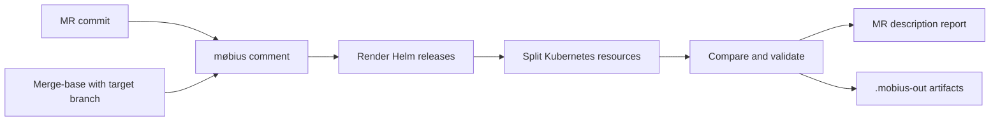

# GitLab MR Report Guide

[Back to documentation index](index.md)

## Purpose

`møbius` is intended to run inside a GitLab merge request pipeline for GitOps cluster repositories and single Helm chart repositories. The MR report answers one reviewer question:

> What Kubernetes resources would this merge request actually add, remove, or change after Helm rendering, values overrides, and schema validation?

The `møbius comment` job renders the cluster state at the merge-base and at the current MR commit, compares both rendered states, validates the current resources offline, and publishes a managed report block to the merge request description by default.



The report is optimized for cloud platform review:

| Report area | Purpose |
| --- | --- |
| **Review Focus** | Shows severity, surfaces, validation gaps, and the highest-risk resources first. |
| **Navigation** | Links directly to changed clusters and charts. |
| **Chart sections** | Groups changed resources by release/chart and summarizes severity, surface, change mix, and validation. |
| **Changes lists** | Links to individual resource diffs. |
| **Artifacts** | Preserve rendered manifests, split resources, diffs, warnings, and preflight status for debugging. |

For details on how reviewers should read each report section, see [report.md](report.md).

## Contents

| Section | Use |
| --- | --- |
| [Choose Your Repository Type](#choose-your-repository-type) | Pick the correct quickstart for a cluster repo or chart repo. |
| [Required Environment](#required-environment) | Configure GitLab tokens, MR variables, repository layout, and overrides. |
| [Customization Options](#customization-options) | Tune CLI flags, apps files, layout, and diff ignore behavior. |
| [Common Pipeline Variants](#common-pipeline-variants) | Continue past render failures, accept duplicate keys, or print markdown only. |
| [Comment Preflight](#comment-preflight) | Understand publish-readiness checks. |
| [Artifacts](#artifacts) | Inspect generated render, diff, warning, and summary files. |
| [Failure Triage](#failure-triage) | Debug failed or incomplete reports. |

## Choose Your Repository Type

Use the GitOps cluster repository quickstart when the repository defines many cluster releases through apps files. Use the single Helm chart repository quickstart when the repository itself is one chart.

### GitOps Cluster Repository

Use this job when the repository follows the default layout:

```yaml
mobius-diff:
  stage: test
  image: ghcr.io/sohooo/moebius:vX.Y.Z
  variables:
    GIT_DEPTH: "0"
    GITLAB_API_TOKEN: "${MOBIUS_GITLAB_API_TOKEN}"
  script:
    - git fetch origin "${CI_MERGE_REQUEST_TARGET_BRANCH_NAME}:${CI_MERGE_REQUEST_TARGET_BRANCH_NAME}"
    - |
      møbius comment \
        --base-ref "${CI_MERGE_REQUEST_TARGET_BRANCH_NAME}" \
        --output-dir .mobius-out
  artifacts:
    when: always
    paths:
      - .mobius-out/
```

Replace `vX.Y.Z` with a pinned release tag. Do not use an unpinned image tag for production pipelines.

Why the defaults matter:

| Setting | Why it is needed |
| --- | --- |
| `GIT_DEPTH: "0"` | Gives `møbius` enough history to calculate a merge-base. |
| `git fetch origin "$CI_MERGE_REQUEST_TARGET_BRANCH_NAME:..."` | Makes the target branch available in detached MR jobs. |
| `GITLAB_API_TOKEN` | Lets `møbius comment` update the MR description. |
| `--base-ref "$CI_MERGE_REQUEST_TARGET_BRANCH_NAME"` | Compares the MR against the intended target branch. |
| `--output-dir .mobius-out` | Keeps diagnostics and rendered artifacts available after success or failure. |

### Single Helm Chart Repository

Use this job when the repository itself is one Helm chart with `Chart.yaml`, `templates/`, and optionally `values.yaml` at the repo root:

```yaml
mobius-chart-diff:
  stage: test
  image: ghcr.io/sohooo/moebius:vX.Y.Z
  variables:
    GIT_DEPTH: "0"
    GITLAB_API_TOKEN: "${MOBIUS_GITLAB_API_TOKEN}"
  script:
    - git fetch origin "${CI_MERGE_REQUEST_TARGET_BRANCH_NAME}:${CI_MERGE_REQUEST_TARGET_BRANCH_NAME}"
    - |
      møbius comment \
        --base-ref "${CI_MERGE_REQUEST_TARGET_BRANCH_NAME}" \
        --chart-path . \
        --release-name my-chart \
        --namespace default \
        --output-dir .mobius-out
  artifacts:
    when: always
    paths:
      - .mobius-out/
```

Chart repository defaults:

| Setting | Default |
| --- | --- |
| `--chart-path` | `.` when chart mode is auto-detected or explicitly selected. |
| `--values-files` | `values.yaml` when that file exists. Missing default `values.yaml` is allowed. |
| `--release-name` | `name` from `Chart.yaml`. |
| `--namespace` | `default`. |

Add environment-specific values files when needed:

```bash
møbius comment \
  --base-ref "${CI_MERGE_REQUEST_TARGET_BRANCH_NAME}" \
  --chart-path . \
  --values-files values.yaml,values-ci.yaml \
  --output-dir .mobius-out
```

Values files are merged in listed order; later files override earlier files. Explicitly listed values files must exist. `møbius` does not run `helm dependency update`, so chart dependencies should be committed or otherwise resolvable by Helm during rendering.

## Required Environment

### GitLab CI Variables

For `møbius comment`, GitLab normally provides most MR context automatically:

| Variable or option | Required | Purpose |
| --- | --- | --- |
| `CI_PROJECT_ID` or `--project-id` | yes | GitLab project containing the MR. |
| `CI_MERGE_REQUEST_IID` or `--mr-iid` | yes | Merge request IID, not the global MR ID. |
| `CI_API_V4_URL` or `CI_SERVER_URL` or `--gitlab-base-url` | yes | GitLab API endpoint. |
| `GITLAB_API_TOKEN` or `--gitlab-token` | yes | Write-capable API token for publishing the report. |
| `GITLAB_TOKEN` or `GITLAB_PRIVATE_TOKEN` | supported | Alternative token variable names accepted by `møbius`. Prefer `GITLAB_API_TOKEN` for new pipelines. |
| `CI_JOB_TOKEN` | no | Informational only: this usually cannot update MR descriptions or create MR notes, so it does not work for publishing the report. |
| `CI_MERGE_REQUEST_TARGET_BRANCH_NAME` | recommended | Used by the quickstart fetch and `--base-ref`. |

Recommended token model:

- Use a project, group, or bot token with API scope.
- Store it as a masked CI/CD variable such as `MOBIUS_GITLAB_API_TOKEN`.
- Assign it to `GITLAB_API_TOKEN` in the job.
- Do not rely on `CI_JOB_TOKEN`; it is useful context for GitLab jobs but is not a publishing token for the MR report.

For local usage outside CI, see the [local quickstart in the README](../README.md#quickstart).

### Repository Layout

The default repository layout is:

```text
clusters/
  kube-bravo/
    apps.yaml
    apps-dev.yaml              # optional per cluster, included in the default apps file list
    overrides/
      default/
        hello-world.yaml
      hello-world.yaml         # fallback
charts/
  hello-world/
    Chart.yaml
    templates/
```

Default release definitions live in `clusters/<cluster>/apps.yaml`. Each apps file is a top-level YAML list:

```yaml
- name: hello-world
  namespace: demo
  project: default
  chart: charts/hello-world
```

For remote Helm repositories:

```yaml
- name: external-dns
  namespace: external-dns
  project: default
  repoURL: https://kubernetes-sigs.github.io/external-dns/
  chart: external-dns
  targetRevision: 1.15.0
```

For OCI charts, use an OCI chart reference and always set `targetRevision`:

```yaml
- name: argo-cd
  namespace: argocd
  project: default
  repoURL: oci://registry.example.com/platform
  chart: argo-cd
  targetRevision: 7.8.0
```

### Override Resolution

For every release, `møbius` looks for values overrides in this order:

| Path | Meaning |
| --- | --- |
| `clusters/<cluster>/overrides/<project>/<name>.yaml` | Primary default path. |
| `clusters/<cluster>/overrides/<name>.yaml` | Fallback default path. |
| no file | Render with chart defaults. |

Overrides are shared for all configured apps files. For example, a release defined in `apps-dev.yaml` still uses `overrides/<project>/<name>.yaml`.

If the same release name appears in both `apps.yaml` and `apps-dev.yaml`, `apps.yaml` wins and the report highlights the duplicate definition as a warning.

## Customization Options

### Common CLI Options

| Option | Use when |
| --- | --- |
| `--cluster kube-bravo` | Limit the report to one cluster. |
| `--all-clusters` | Render all current clusters instead of only changed clusters. |
| `--chart-path .` | Run against a single Helm chart repository instead of a cluster layout. |
| `--values-files values.yaml,values-ci.yaml` | Render chart mode with explicit values files, merged in order. |
| `--release-name my-chart` | Override the chart-mode Helm release name. |
| `--namespace default` | Override the chart-mode Helm release namespace. |
| `--apps-files apps.yaml,apps-dev.yaml` | Load multiple apps files per cluster. Earlier files win on duplicate release names. |
| `--clusters-dir environments` | Use a cluster root other than `clusters/`. |
| `--publish-target note` | Publish a sticky MR note instead of updating the MR description. |
| `--comment-mode summary` | Publish a compact report. |
| `--comment-mode summary+artifacts` | Publish a compact report and rely on artifacts for details. |
| `--render-error-mode warn-skip-release` | Keep reporting other releases when one release cannot render. |
| `--duplicate-key-mode warn-last-wins` | Accept duplicate YAML keys from rendered manifests and keep the last value. |
| `--max-comment-bytes 75000` | Change the threshold before comment output falls back to summary mode. |

### Multiple Apps Files

Configure multiple apps files through CLI:

```yaml
script:
  - git fetch origin "${CI_MERGE_REQUEST_TARGET_BRANCH_NAME}:${CI_MERGE_REQUEST_TARGET_BRANCH_NAME}"
  - |
    møbius comment \
      --base-ref "${CI_MERGE_REQUEST_TARGET_BRANCH_NAME}" \
      --apps-files apps.yaml,apps-dev.yaml \
      --output-dir .mobius-out
```

Or through environment:

```yaml
variables:
  MOBIUS_APPS_FILES: "apps.yaml,apps-dev.yaml"
```

Precedence is first-wins. If `apps.yaml` and `apps-dev.yaml` define the same release name, the release from `apps.yaml` is used and the later duplicate is reported as a warning.

### Custom Layout

Use a checked-in `config.yaml` when the whole repository follows a custom convention:

```yaml
layout:
  clusters_dir: environments
  apps:
    files:
      - releases.yaml
    fields:
      name: release_name
      namespace: target_namespace
      project: argocd_project
      repoURL: repo_url
      chart: chart_ref
      targetRevision: chart_target_revision
  overrides:
    path: values/{project}/{name}.yaml
    fallback_path: values/{name}.yaml
```

Use `MOBIUS_CONFIG_YAML` when the CI job needs to inject the layout without committing a config file:

```yaml
variables:
  MOBIUS_CONFIG_YAML: |
    layout:
      clusters_dir: environments
      apps:
        files:
          - releases.yaml
        fields:
          name: release_name
          namespace: target_namespace
          project: argocd_project
          repoURL: repo_url
          chart: chart_ref
          targetRevision: chart_target_revision
      overrides:
        path: values/{project}/{name}.yaml
        fallback_path: values/{name}.yaml
```

Configuration precedence:

| Priority | Source |
| --- | --- |
| 1 | Built-in defaults |
| 2 | repo-root `config.yaml` |
| 3 | `MOBIUS_CONFIG_YAML` |
| 4 | `MOBIUS_APPS_FILES` |
| 5 | CLI overrides such as `--clusters-dir` and `--apps-files` |

More detail is in [configuration.md](configuration.md).

### Pipeline Diff Ignore Overrides

By default, `møbius` suppresses common Helm metadata churn in MR reports, including chart/version labels and checksum annotations. Use `MOBIUS_CONFIG_YAML` when a pipeline needs different ignore behavior.

Disable built-in ignores for one pipeline:

```yaml
variables:
  MOBIUS_CONFIG_YAML: |
    diff:
      ignore:
        defaults: false
```

Keep built-ins and add repo-specific metadata noise:

```yaml
variables:
  MOBIUS_CONFIG_YAML: |
    diff:
      ignore:
        defaults: true
        metadata:
          - locations:
              - metadata
              - spec.template.metadata
              - spec.jobTemplate.spec.template.metadata
            labels:
              - app.example.com/build-id
            annotations:
              - checksum/*
              - rollme
```

`MOBIUS_CONFIG_YAML` is an overlay, not an append-only patch. If `config.yaml` already contains `diff.ignore.metadata` and CI should add more patterns, include the full desired metadata rule list in `MOBIUS_CONFIG_YAML`.

## Common Pipeline Variants

Continue when one release fails to render:

```yaml
script:
  - git fetch origin "${CI_MERGE_REQUEST_TARGET_BRANCH_NAME}:${CI_MERGE_REQUEST_TARGET_BRANCH_NAME}"
  - |
    møbius comment \
      --base-ref "${CI_MERGE_REQUEST_TARGET_BRANCH_NAME}" \
      --render-error-mode warn-skip-release \
      --output-dir .mobius-out
```

Accept duplicate YAML keys emitted by a chart:

```yaml
script:
  - git fetch origin "${CI_MERGE_REQUEST_TARGET_BRANCH_NAME}:${CI_MERGE_REQUEST_TARGET_BRANCH_NAME}"
  - |
    møbius comment \
      --base-ref "${CI_MERGE_REQUEST_TARGET_BRANCH_NAME}" \
      --duplicate-key-mode warn-last-wins \
      --output-dir .mobius-out
```

Print markdown to the job log without updating the MR:

```yaml
script:
  - git fetch origin "${CI_MERGE_REQUEST_TARGET_BRANCH_NAME}:${CI_MERGE_REQUEST_TARGET_BRANCH_NAME}"
  - |
    møbius diff \
      --base-ref "${CI_MERGE_REQUEST_TARGET_BRANCH_NAME}" \
      --output-format markdown \
      --output-dir .mobius-out
```

## Comment Preflight

Before posting, `møbius comment` validates:

- project ID
- merge request IID
- GitLab API base URL
- resolved token source and kind
- ability to reach the GitLab MR API
- ability to update the MR description, or notes when `--publish-target note` is used

If preflight fails, `møbius comment` still builds the diff report, writes available artifacts, prints a concise failure summary, falls back to printing the report to stdout, and exits non-zero.

For a fast local preflight before touching CI, run:

```bash
mobius doctor
```

If GitLab-related environment variables or tokens are present, `mobius doctor` also performs a live GitLab publish-readiness check. Without GitLab context, it stays local and reports that GitLab checks were skipped.

## Artifacts

When `--output-dir .mobius-out` is used, `møbius` writes:

| Path | Contents |
| --- | --- |
| `.mobius-out/index.md` | Human-readable artifact index and cluster summary. |
| `.mobius-out/summary.json` | Machine-readable summary counts and artifact names. |
| `.mobius-out/comment-preflight.json` | GitLab publish preflight status. |
| `.mobius-out/current/...` | Current rendered manifests and split resources. |
| `.mobius-out/baseline/...` | Merge-base rendered manifests and split resources. |
| `.mobius-out/diff/...` | Per-resource raw and semantic diffs. |
| `.mobius-out/errors/<state>--<cluster>--<release>.txt` | Render or split errors captured during report generation. |
| `.mobius-out/warnings/<state>--<cluster>--<release>.txt` | Missing chart versions, duplicate key warnings, and other non-fatal render notices. |

## Failure Triage

Start with the artifacts:

1. Open `.mobius-out/comment-preflight.json`.
2. Open `.mobius-out/index.md`.
3. Inspect `.mobius-out/errors/` and `.mobius-out/warnings/`.
4. If the failure is GitLab-specific, see [troubleshooting.md](troubleshooting.md).

Useful local checks:

```bash
mobius clusters
mobius doctor
mobius diff --all-clusters --output-dir .mobius-out
```
