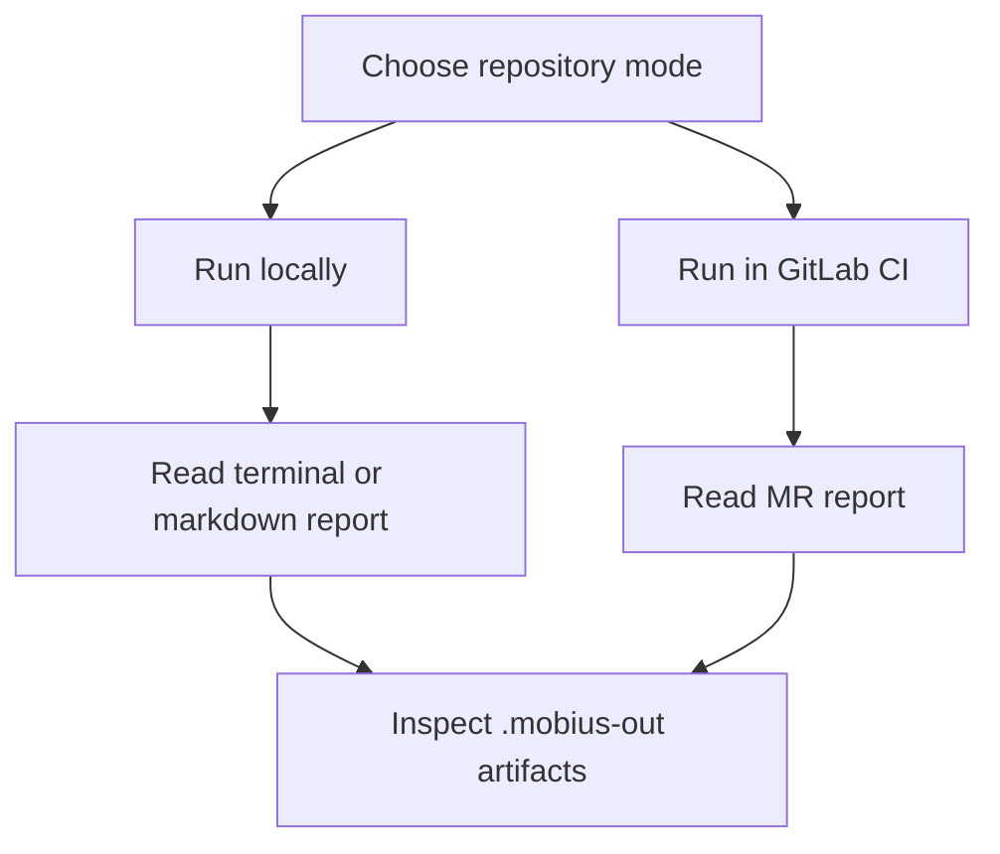

# Documentation

Start here when setting up or reviewing `møbius`.

`møbius` renders Helm output at the merge-base and current commit, splits the rendered YAML into Kubernetes resources, compares the two states, validates current resources offline, and reports what a merge request would actually change.

## Usage Modes

| Mode | Repository shape | Start with |
| --- | --- | --- |
| GitOps cluster repository | `clusters/<cluster>/apps.yaml`, optional `apps-dev.yaml`, and `overrides/` values | [GitLab CI guide](gitlab-ci.md#gitops-cluster-repository) and [configuration](configuration.md) |
| Single Helm chart repository | root `Chart.yaml`, `templates/`, optional `values.yaml`, optional vendored subcharts | [GitLab CI guide](gitlab-ci.md#single-helm-chart-repository) and [CLI reference](cli.md) |
| Local review | any supported repository with a resolvable base ref | [CLI reference](cli.md#examples) |



## Where Should I Go?

| Task | Page |
| --- | --- |
| Set up a GitLab MR pipeline | [GitLab CI guide](gitlab-ci.md) |
| Run `møbius` locally or inspect flags | [CLI reference](cli.md) |
| Configure cluster layouts, apps files, overrides, and diff ignores | [Configuration](configuration.md) |
| Understand Review Focus, Attention Required, severity, validation, and artifacts | [MR report guide](report.md) |
| Fix pipeline, rendering, validation, token, or release problems | [Troubleshooting](troubleshooting.md) |
| Check embedded Kubernetes, CNPG, Kyverno, and platform schema versions | [Schema bundles](schema-bundles.md) |
| Install from Go, GHCR, or GitHub Releases | [Releases and distribution](releases.md) |
| Compare expected report formats | [GitLab MR sample](sample-comment.md) and [standalone markdown sample](sample-report.md) |

## Common Starting Points

For a GitOps cluster repository:

```bash
mobius diff --cluster kube-bravo
```

For a single Helm chart repository:

```bash
mobius diff --chart-path .
```

For a GitLab MR pipeline, use the pinned container image and publish through `møbius comment`; see [gitlab-ci.md](gitlab-ci.md).
