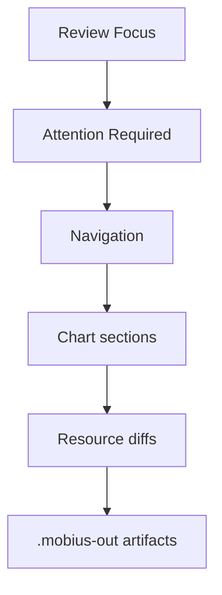

# MR Report Guide

[Back to documentation index](index.md)

This page explains how to read the GitLab MR report generated by `mobius comment`. For pipeline setup, see [gitlab-ci.md](gitlab-ci.md).

Sample outputs are available for the [GitLab MR report](sample-comment.md) and [standalone markdown report](sample-report.md).

## Reviewer Flow

Use the report from top to bottom:

1. Start with **Review Focus** to see the highest-risk signals.
2. Check **Attention Required** before reviewing normal chart diffs.
3. Use **Navigation** to jump to clusters and charts with changes.
4. Review each chart's signal table, hints, and linked resource diffs.
5. Use `.mobius-out/` artifacts when the MR report is summarized or a render problem needs deeper inspection.

## Report Sections

| Section | How to use it |
| --- | --- |
| **Review Focus** | Quickly scan severity totals, changed surfaces, change mix, validation errors, warnings, and unvalidated resources. |
| **Attention Required** | Triage critical/high changes, validation failures, render warnings, RBAC, webhooks, storage, and external exposure before lower-risk diffs. |
| **Navigation** | Jump to each changed cluster and see cluster-level severity counts. |
| **Chart sections** | Review one Helm release at a time, including namespace, highest severity, change mix, surface, scope, validation, and review hints. |
| **Changes** | Follow resource links from a compact chart-level list to the detailed diff. |
| **Resource details** | Inspect the exact semantic diff and validation status for a Kubernetes object. |

## Severity And Surfaces

Severity icons prioritize review order:

| Icon | Meaning |
| --- | --- |
| 🔴 | Critical |
| 🟠 | High |
| 🟡 | Medium |
| 🟢 | Low |
| 🔵 | Informational |

Surfaces describe the kind of platform impact, such as `security`, `networking`, `storage`, `workload`, or `database`. Treat a lower severity item on a sensitive surface as still worth human review when it affects shared infrastructure.

## Suppressed Metadata Noise

`møbius` omits known non-actionable Helm metadata churn from semantic diffs by default. This includes common chart/version labels and checksum annotations such as `app.kubernetes.io/version`, `helm.sh/chart`, and `checksum/config`.

If a resource only changed in ignored metadata paths, it is treated as unchanged and does not appear in the MR report. If a resource has both ignored metadata and actionable changes, only the actionable changes are shown. Repository maintainers can tune this behavior in [configuration.md](configuration.md#diff-ignore-rules).

## Validation Signals

Validation states are reviewer signals, not deployment gates:

| State | Meaning |
| --- | --- |
| `validated via rendered CRD` | The current render included a matching CRD schema. |
| `validated via embedded` | The resource matched a committed schema bundle. |
| `unvalidated` | No matching schema was available; review manually. |
| `validation error` | A schema or semantic validator found a concrete issue. |
| `warning` | Rendering or parsing continued, but a non-fatal problem was recorded. |

Validation gaps are promoted when they affect critical or high severity resources. Check those manually, then decide whether the schema bundle should be expanded; see [schema-bundles.md](schema-bundles.md).

## Review Hints

Review hints are deterministic prompts derived from the changed resource and findings. They are intentionally concise:

| Hint area | Typical reviewer check |
| --- | --- |
| RBAC | Confirm new permissions are intentionally scoped. |
| Webhooks | Confirm admission behavior and failure policy. |
| Networking | Confirm external reachability, hosts, TLS, and load balancer impact. |
| Storage | Confirm persistence, reclaim policy, migration, and data retention impact. |
| Workloads | Confirm image source, tag, rollout, replicas, and disruption expectations. |

## Summary Fallback And Artifacts

If the full report is too large for GitLab, `møbius` falls back to a compact summary. The detailed material remains in `.mobius-out/` when `--output-dir` is set.

Use these artifacts first:

| Artifact | Use |
| --- | --- |
| `.mobius-out/index.md` | Human-readable summary and links to generated artifacts. |
| `.mobius-out/summary.json` | Machine-readable counts and artifact names. |
| `.mobius-out/run-summary.md` | Effective options, apps files, selected releases, skipped releases, and reasons. |
| `.mobius-out/run-summary.json` | Machine-readable run summary for diagnostics. |
| `.mobius-out/current/` and `.mobius-out/baseline/` | Rendered manifests and split resources for each side of the comparison. |
| `.mobius-out/diff/` | Per-resource raw and semantic diffs. |
| `.mobius-out/errors/` | Render or split failures. |
| `.mobius-out/warnings/` | Non-fatal render, YAML, or chart warnings. |
